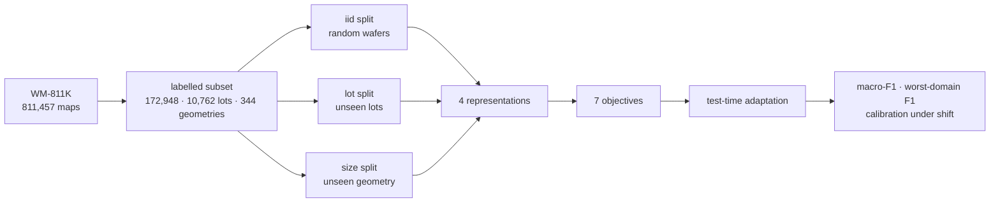

# Wafer Tool Shift

**A domain-shift benchmark for wafer-map defect classification, and a fair test
of the methods people bring to it.**

Published wafer-map results are almost always reported on a random split of
WM-811K. But wafers arrive in **lots** — a lot shares equipment, timing and
process condition — so a random split puts wafers from the same lot on both
sides. The number that comes out answers "can the model recognize a pattern it
has already seen from this tool", when the question a fab actually has is **"will
it hold on the next tool"**. That question is *tool-to-tool matching*, and it is
what SK hynix and Gauss Labs presented on at SPIE Advanced Lithography 2026
after five years of running virtual metrology in production.

This repo turns the public corpus into that question, and then measures — rather
than assumes — whether a menu of methods borrowed from other fields helps.



## The three protocols

| protocol | held out | what it measures |
|---|---|---|
| `iid` | nothing (random wafers) | the optimistic number papers report |
| `lot` | whole `lotName` groups | generalization to an unseen tool / time window |
| `size` | whole wafer geometries | generalization to an unseen product |

Holding out groups cannot hold the label marginal fixed, so `wts.data.label_shift`
reports the total-variation distance that each protocol induces. It is near zero
for `iid` and `lot`, and non-trivial for `size` — geometry and defect class are
entangled in this corpus, because a product tends to fail the way its design
fails. That entanglement is a finding, not a bug, and the report states it next
to the numbers.

Two details keep the protocols honest:

- **Model selection never touches the test domains.** Each cell carves a
  *domain-disjoint* validation split out of its training domains. Selecting on
  an iid validation set is the quiet way domain-generalization results get
  inflated, so the runner does not offer it.
- **The rarest-geometry-first version of the `size` split was thrown away.**
  Taking the rarest geometries as the test side looked appealing and pushed 96%
  of all Edge-Ring wafers into test — the split stopped measuring covariate
  shift and started measuring label shift. Geometries are held out at random
  instead.

## Four representations, three different answers to geometry

The corpus has 344 distinct map sizes. The standard pipeline resizes everything
to a fixed grid, which makes the model's features a function of the resampling
and makes the "unseen geometry" question unanswerable.

| representation | how it treats geometry |
|---|---|
| `cnn_bn` / `cnn_gn` | resample to 64x64 and run a small CNN — the conventional baseline, with BatchNorm and GroupNorm as separate cells because BN mixes statistics across whatever is in the batch, which is a domain leak when batches span lots |
| `spectral` | a Fourier neural-operator encoder: learned weights multiply a fixed number of low-frequency coefficients, so the same weights apply to a 25x27 and a 53x58 wafer with **no resizing at all** — discretization invariance by construction, carried over from the sibling repo [`pde-neural-operator`](https://github.com/gggg8657/pde-neural-operator) |
| `feat` | an MLP over hand-built descriptors that are size-invariant because each one is a rate, a moment or a spectrum rather than a pixel |

### The descriptors, and where they were borrowed from

This is the part worth stealing. Each descriptor maps a wafer of *any* shape to
a fixed-length vector, and each one comes from a field that already solved the
same geometric problem:

| descriptor | borrowed from | why it fits a wafer |
|---|---|---|
| **Zernike moments** | optics / wavefront sensing | the orthogonal basis *on a disk* — and already the language lithography uses for aberration. Paired `(n, m)` magnitudes are rotation-invariant, so a wafer's placement in the cassette stops mattering |
| **Betti curves** | topological data analysis | `Donut` is literally a one-dimensional homology class. Computed on superlevel sets of the failure *density*, not the binary mask — filtering the mask directly fills every class with spurious loops (measured: β₁ persistence 0.36 for Donut against 0.06–0.13 for every other class, versus no separation at all on the raw mask) |
| **radial / angular profile** | astronomy, surface photometry | "edge or center" is a radial statement; sectors catch localized failure |
| **variogram** | geostatistics, mining | separates systematic spatial correlation from random speckle with no model fitted |
| **radial power spectrum** | signal processing / operator learning | binning `|k|` as a *fraction of Nyquist* makes the descriptor grid-independent by construction — the same argument as a spectral operator: act on coefficients, not samples |
| **classical moments** | image analysis | fail rate, centroid radius, eccentricity, fragmentation, largest-blob share |

124 dimensions total, 0.12 ms per wafer, and the whole labelled corpus is
described in 21 seconds on 24 cores.

## Seven objectives, and the honest prior

The starting position is that domain-generalization methods **often fail to beat
plain ERM** once evaluation is fair — the WILDS line of work and the "has any
progress been made?" critiques. So every method is implemented to be measured
against ERM at the same budget with the same model selection, and the report
shows the delta with its sign.

| objective | borrowed from | the assumption it makes |
|---|---|---|
| `erm` | — | none; the number everything else must beat |
| `logit_adjust` | long-tail recognition | the label prior shifts, the class-conditional does not |
| `group_dro` | robust optimization / economics | the worst domain is what matters, not the average |
| `dann` | domain adaptation | features that cannot predict the domain transfer better |
| `irm` | causal inference | one predictor is optimal in every domain simultaneously |
| `coral` | domain adaptation | aligning second moments across domains is enough |
| `mixup_domain` | vicinal risk / LISA | interpolating *across* domains fills the space between them |

Plus what a fab could actually deploy, using only the **unlabelled** wafers from
the new tool:

| method | borrowed from | what it changes at test time |
|---|---|---|
| `adabn` | domain adaptation | recomputes BatchNorm statistics on the target lot — nothing is learned |
| `tent` | test-time entropy minimization | one step on the norm layers' affine parameters |
| `ema` | weight averaging (SWA / SWAD) | averaged weights, a free check on whether flatness helped |
| `fda` | Fourier domain adaptation | swaps low-frequency amplitude toward the target, no adversarial machinery |

## Metrics that a model cannot game

- **macro-F1** over 9 classes and **defect macro-F1** over the 8 defect classes —
  85% of the corpus is `none`, so accuracy is meaningless here.
- **worst-domain and 10th-percentile domain macro-F1.** An average hides the
  failure this benchmark exists to expose: a model can post a fine mean while
  being useless on one tool. A lot holds at most 25 wafers, so the single worst
  lot is noisy and the p10 is the headline.
- **ECE**, and **class-conditional conformal coverage** calibrated on held-out
  *training* domains and measured on test — coverage under shift, which is what
  tells you whether an uncertainty guarantee survives a new tool. Class-conditional
  rather than marginal, because a marginal guarantee is satisfied by covering
  `none` and abandoning `Near-full`.

## Results

See [`RESULTS.md`](RESULTS.md) — regenerated by `scripts/report.py` from the JSON
each cell writes, so nothing in it is hand-typed.

## Reproduce

```bash
pip install -r requirements.txt
# WM-811K (LSWMD.pkl) goes in data/ — see the note below
python scripts/prepare.py            # cache the labelled subset + protocols
python scripts/extract.py --workers 16   # the size-invariant descriptors
bash scripts/sweep.sh                # the benchmark matrix, 2 GPUs
python scripts/report.py             # -> RESULTS.md
```

`LSWMD.pkl` is a Python-2-era pandas pickle and does not load on a modern
pandas. Two things are needed, and `wts.data` does both: shim the pre-0.20
module layout (`pandas.indexes` → `pandas.core.indexes`) and unpickle with
`encoding="latin1"`.

## Layout

```
wts/
  data.py       WM-811K loader, the three protocols, label-shift measurement
  features.py   the borrowed descriptors (Zernike, Betti, variogram, ...)
  models.py     CNN / spectral operator / descriptor-MLP encoders
  methods.py    ERM, logit adjustment, GroupDRO, DANN, IRM, CORAL, domain mixup
  tta.py        AdaBN, TENT, Fourier amplitude swap
  metrics.py    macro-F1, worst-domain F1, ECE, class-conditional conformal
scripts/
  prepare.py    cache the corpus and print the protocol summary
  extract.py    descriptors for 172,948 wafers, parallel
  run_bench.py  one cell: (representation, objective, protocol)
  sweep.sh      the matrix across two GPUs
  report.py     regenerates RESULTS.md
```

## What this demonstrates

- **Reframing a public dataset into the question industry actually has** — lot
  and geometry as domains, not rows to shuffle.
- **Method transfer across fields** — optics, topology, geostatistics,
  astronomy, causal inference and robust optimization, each applied where its
  assumption actually holds, and each measured against ERM rather than assumed
  to help.
- **Evaluation discipline** — domain-disjoint model selection, label shift
  measured instead of ignored, worst-group before average, calibration under
  shift, and a rejected split design documented rather than hidden.

MIT licensed. Data: WM-811K (MIR Lab), used under its original terms.
